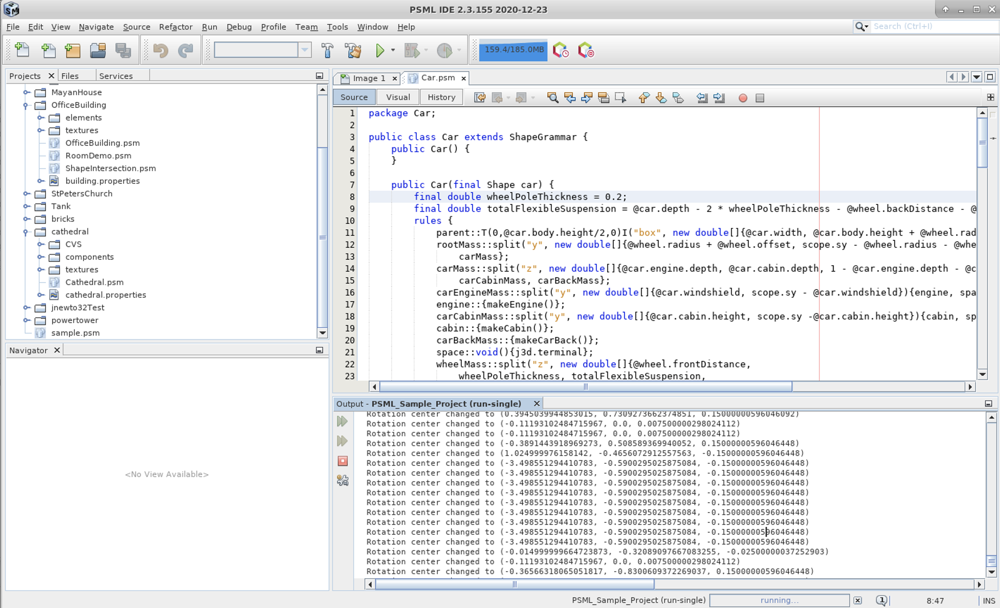
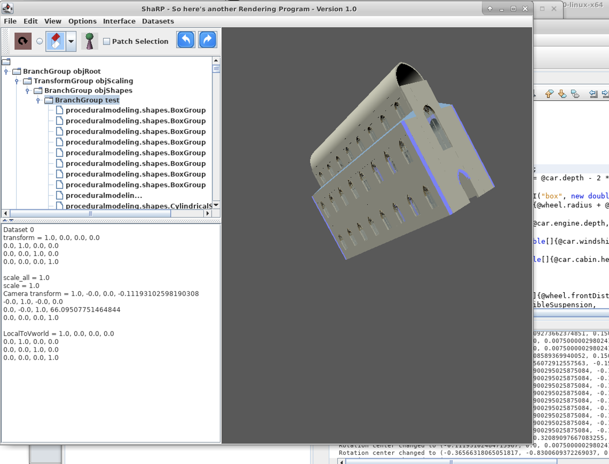

# PSML-Netbeans-IDE

This repository contains the official PSML IDE implementation for our paper $\bf{Volumetric Procedural Models for Shape Representation}$. The paper describes a volumetric approach for procedural shape modeling and a new Procedural Shape Modeling Language (PSML) that introduces a distinct programming construct for procedural model generation that borrows structure and syntax for sequential statements from Java and borrows structure and syntax for shape grammars and their production rules from L-systems. This repo contains the IDE implementation for PSML programs. It also provides some sample programes that are showed in the paper.

#Requirements:

Software: Netbeans +v11.3 IDE

OS: Linux/Windows (X64). It’s not compatitable with recent versions of MacOS

*Note: You can run the IDE with default java but the PSML "java" project that comes with the PSML sample code MUST run using JDK 1.8 or it will not work. This release of the PSML runtime software is compatible with JDK 8 do not run PSML code with JDK 9+.*

# Usage:

In the release page, we release the PSML IDE binaries. There are two forms of this initial release and you can use either of them to run the IDE:

## Usage 1

[psmlide-v1.0-linux-x64.zip](https://github.com/uncc-visionlab/psml-netbeans-ide/releases/download/v1.0.0-alpha/psmlide-v1.0-linux-x64.zip) ([psmlide-v1.0-windows-x64.zip](https://github.com/uncc-visionlab/psml-netbeans-ide/releases/download/v1.0.0-alpha/psmlide-v1.0-windows-x64.zip))

This is a complete re-branded version of the Apache Netbeans v11.3 IDE that includes PSML sample programs and the PSML libraries and runtime to allow users to run sample PSML programs, create their own PSML programs and basic visualization tools for viewing PSML generated geometries in 3D.

$\cdot$ Download the zip file and extract it

$\cdot$ Run following:

`cd /path_to_psmlide-v1.0-linux-x64/`

`./bin/psmlide`

$\cdot$ PSML IDE will be opened. In the IDE menu, go to *Tools > Plugins > Installed*, make sure the following plugins, “PSML Sample Project”, “Ant”, “AntBasedProjectType”, “FileType”, “EditorTools” and “PSMLPrimitiveLayoutApp”, are activated. 

$\cdot$  In the IDE menu, go to *File->New Project*, then in the pop-up window, choose *Samples > PSML* in the “Categories” column and *PSML Sample Project* in the “Projects” column. Click “Next” to create the projcet in your desinated path then click “finish”.

$\cdot$ Now on the left sidebar, under “Projects”, you will see two items “java” and “PSMLSampleProjects”. If the “java” item shows in red font, it means some issues needs to be resolved. To do that, right click the “java” and click “resovle”, then choose "JDK 11” instead of the default "JDK 1.8”.

$\cdot$ Right click “PSMLSampleProjects”, then click “Build” to compile the project. After it compiles, click the key-alike button next to the “PSMLSampleProjects” to open the project, then open “cathedral” by doing the similar operation. After this, right click “Cathedral.psm” then click “run”. It will run the cathedra model we build. Once it finishes running, a window of the rendering program will pop up and you will see the cathedra model. Click “BrachGroup test” to select it, then you are able to visulize the model. Holding left click will enable you to rotate the model and right click to move the model. Hold "Shift + right click" then move the mouse so you can zoom in/out to see more model details. 

$\cdot$ You can right click “BrachGroup test” for more information and operations on the model.

## Usage 2
[psml-netbeans-v11.3-plugin-modules.zip](https://github.com/uncc-visionlab/psml-netbeans-ide/releases/download/v1.0.0-alpha/psml-netbeans-v11.3-plugin-modules.zip) (Netbeans +v11.3 required)

This file contains the nbm files to install to an Apache Netbeans +v11.3 IDE. It will allow you to explore PSML by compiling and running the PSML sample programs, create your own PSML programs and basic visualization tools for viewing PSML generated geometries in 3D.

$\cdot$ Download and open Netbeans v11.3 or later

$\cdot$ Download the zip file and extract it

$\cdot$ Go to NetBeans *Tools > Plugins > Downloaded* menu and click on ‘Add Plugins…’. Select the nbm files in your downloaded folder and click “install". This will install the nodejs plugin.

$\cdot$ Clone the whole PSML-NetBeans-IDE project and open it in NetBeans

$\cdot$ One the sidebar, right click the opened project(“PSML IDE”), go to *properties > Manage Java Platforms > Add Platform*, add JDK 1.8 from your computer. It must run using JDK 1.8.

$\cdot$ On the “Project Properties” window, choose JDK 1.8 as your Java Platform then click “OK".

$\cdot$ Now you can build project then run it. When running, it will open the PSML IDE. You can either create your own PSML programs or follow the steps 4-6 in the $\bf{Usage 1}$

# Video Demo
https://drive.google.com/file/d/1dCdQWRhbi34i00vUQ648sRAo6xtSg_Ty/view?usp=sharing

